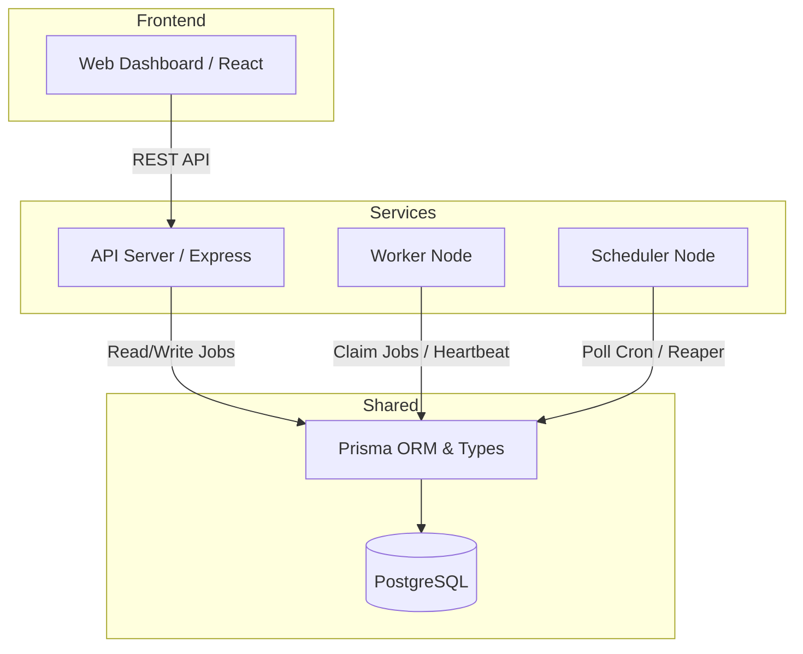
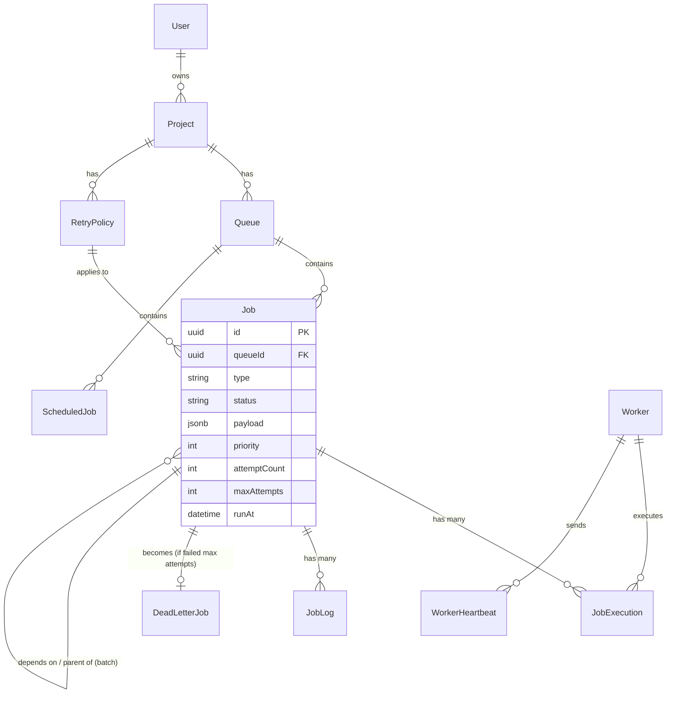

# Distributed Job Scheduler

A production-inspired, horizontally scalable distributed background job scheduling platform built entirely from scratch in Node.js and TypeScript, using PostgreSQL as the primary data store and locking mechanism.


## Features

- **Atomic Job Claiming:** Custom concurrency control using Postgres `FOR UPDATE SKIP LOCKED` ensures exactly-once execution across multiple distributed workers without external message queues like Redis or RabbitMQ.
- **Job Types:** Supports `IMMEDIATE`, `DELAYED`, `SCHEDULED` (specific date/time), `RECURRING` (Cron expressions), and `BATCH` jobs.
- **Retry & Backoff:** Configurable retry policies including Fixed, Linear, and Exponential backoff strategies.
- **Dead Letter Queue (DLQ):** Permanently failed jobs are routed to a DLQ for manual inspection and requeuing.
- **Graceful Shutdown & Heartbeats:** Workers send active heartbeats. A dedicated dead-worker reaper detects orphaned jobs from crashed workers and safely requeues them.
- **Modern Dashboard:** Real-time React + Vite + Tailwind dashboard with auto-polling for monitoring queues, jobs, and worker health.
- **RESTful API:** Fully featured and JWT-secured Express API for all operations.

## Architecture

The project is structured as an `npm` monorepo with the following packages:



## Entity-Relationship Diagram (ERD)

The relational database is designed to strictly enforce integrity, cascading deletes, and complex relationships (like job dependencies and batch grouping).



## Quick Start

### 1. Requirements
- Node.js v20+
- Docker Desktop (for PostgreSQL)

### 2. Setup

Clone the repository and install dependencies from the root:
```bash
npm install
```

Start the PostgreSQL database:
```bash
docker compose up -d
```

Run database migrations and seed the database with initial test data (Admin user, queues, policies, and sample jobs):
```bash
npm run migrate
npm run seed
```

### 3. Running the Platform

You can run the entire platform concurrently from the root directory:
```bash
npm run dev
```

Alternatively, you can run services individually in separate terminals:
- **API Server:** `cd api && npm run dev` (Runs on `http://localhost:3000`)
- **Worker Node:** `cd worker && npm run dev`
- **Scheduler Node:** `cd scheduler && npm run dev`
- **Web Dashboard:** `cd web && npm run dev` (Runs on `http://localhost:5173`)

### 4. Accessing the Dashboard

Open your browser to `http://localhost:5173`.
- **Email:** `admin@example.com`
- **Password:** `password123`

## API Endpoints

*The API is secured via JWT. Pass `Authorization: Bearer <token>` in the headers.*

- `POST /auth/login` - Authenticate
- `GET /jobs` - List jobs (filterable by queueId, status, type)
- `POST /jobs` - Enqueue a new job
- `POST /jobs/:id/cancel` - Cancel a pending job
- `GET /workers` - List active workers and their status
- `GET /dead-letter-jobs` - View permanently failed jobs

## License

MIT
